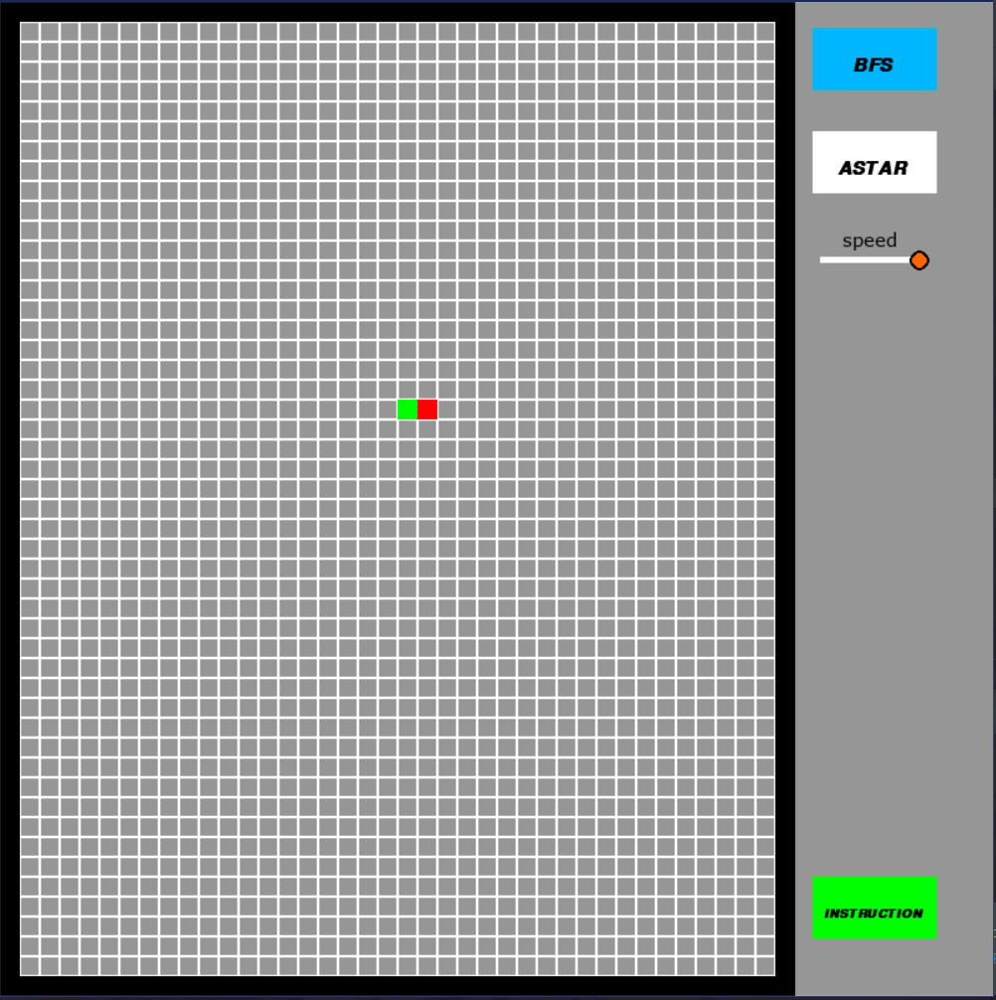

This is a prototype pathfinding graphic game in python using pygame. The program will be interactive and demonstrats how each pathfinding algorithm works visually.

### Legend

- Cell = Square in the grid
- Red Cell = End Point
- Green Cell = Starting Point
- Black Cell = Border
- Dark Grey Cell = Walls
- Light Grey Cell = Empty Cell

- Orange Cell = Next to Visit
- Yellow Cell = Visited Cell
- Blue Cell = Current Cell
- Purple Cell = Path

To get started left click or drag start/endpoint to the desire location on the grid. Left-click or drag along empty cells to create walls/obstacles. Right drag along walls to delete the walls. Left-click on buttons on the right to select different pathfinding algorithms. Press ‘space’ to start.

To erase everything including walls, and reset the grid, press ‘z’. 
To erase the colours/pathfinding indicators, press ‘x’.

